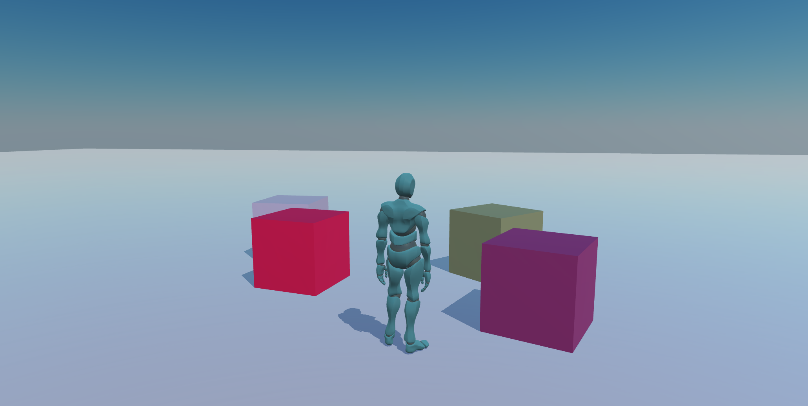

# Third person template

[](https://github.com/BarthPaleologue/babylonjs-template/actions/workflows/webpack.yml)
[](https://github.com/BarthPaleologue/ThirdPersonTemplate/actions/workflows/deploy.yml)



A simple template to quick start a BabylonJS project with a working third person character controller, webpack config, prettier and eslint.

This project has been created using **webpack-cli**, you can now run

```
npm run build
```

or

```
yarn build
```

to bundle your application
